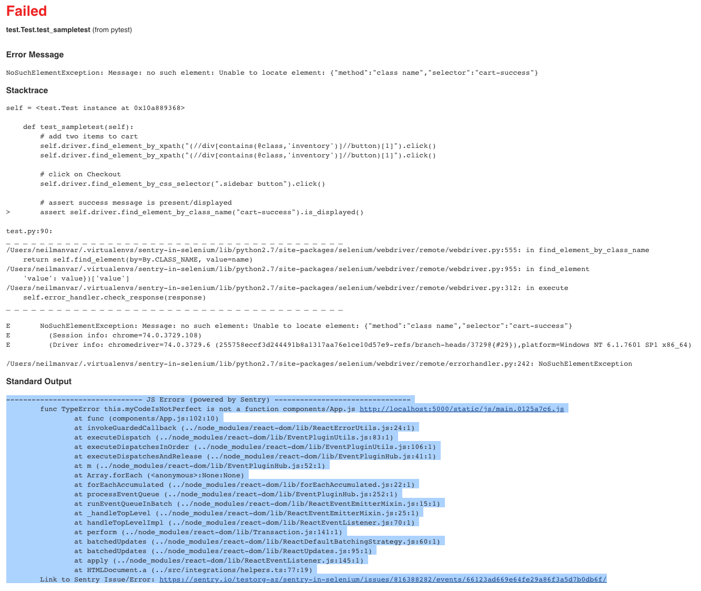

# sentry-in-selenium

## Goal/Summary:
Surface JS Errors from Selenium tests in CI (via test result report)

## How this works:
Sentry is setup/configured within application.
Selenium checks to see if Raven is configured, if so it adds selenium-sessionid as a tag.
At the end of test (tearedown), selenium checks to see if there were any errors.
If errors occured, then hit Sentry events REST API to and obtains relevant (using selenium-sessionid tag) events/errors.
The link to the errors are output to stdout, which is massaged into test result report (junit report).
JUnit Test Report read in by CI.

## Setup
1. Set SENTRY_AUTH_TOKEN to generated auth token with proper permissions: `export SENTRY_AUTH_TOKEN=XXXXXXX`
2. Set SAUCE_USERNAME and SAUCE_ACCESS_KEY env var
3. Run Sauce Connect (`make sc`)
4. Install dependencies/packages: `pip install -r requirements.txt`

## Run
5. `pytest --junitxml=report.xml test.py` -> This should run the tests on Sauce and javascript errors should be surfaced in report (soon will surface in console also)

## Test result contains links to sentry issues for each JS error

